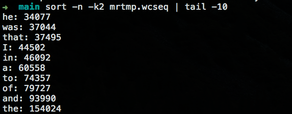

# 老司机带你用 Go 语言实现 MapReduce 框架


   MapReduce是Google提出的一个软件架构，用于大规模数据集（大于1TB）的并行运算。
简而言之，就是将任务切分成很小的任务然后一个一个区的执行最后汇总，这就像小时候我们老师
经常教育我们一样，大事化小，小事化了（瞬间感觉那时候老师好言简意赅啊!!!）思想就这么一个
思想，那么按照这个思想在现代软件定义一切的世界里面，我们怎么运用这样的方式来解决海量数据
的处理，这篇就告诉你一个这样的一个简单的实现使用Go 语言

#上车了

简单介绍一下几个概念:
    概念“Map（映射）”和“Reduce（归纳）”，及他们的主要思想，都是从函数式编程语言借来的，还有从矢量编程语言借来的特性。当前的软件实现是指定一个Map（映射）函数，用来把一组键值对映射成一组新的键值对，指定并发的Reduce（归纳）函数，用来保证所有映射的键值对中的每一个共享相同的键组。

以一个例子为简单的开始:
    词频的统计（WorldCount）,在现实的需求的上面可能我们可能有这样的一个需求，就是计算出一篇文章里面出现每个单词的个数。具体到生活就是，就算TopN 的结果，比如全校要开表彰大会，找出10 个好学生这样的Top N 这样的例子比比皆是，而World Count 就是他的一个实现，只是最终的结果只取出排在前面的结果而已。
    有了上面找出10个好学生的需求的时候，我们来想想怎么去实现它呢，很显然这个需求可能是校长在开会的时候提出来的，那么具体的实现就是每个年级组长是不是要把每个年级排名前10 的学生找出来，然后年级组长的领导，将这些信息在汇总取出 前10 的学生咯，那么具体的每个年级怎么做呢？同理，将每个班的前10名学生找出来，然后汇总到年级部门咯。

#代码了

基本概览和思路已经明白了，现在开始构建整个MapReduce 框架了，首先我们明确一个思想就是，将任务划分成合适的大小，然后对其进行计算，然后将每一步计算的的结果，进行一个汇总合并的过程。那么这两个过程我们先分别定义为Map 和Reduce 过程。
还是以 World Count 这个为例子
    Map 的处理过程就是读取给定的文件，将文件里面的每个单词的出现频率初始化为1  
    Reduce 的处理过程就是将 相同的单词，数据进行一个累加的过程
那么我们MapReduce 框架的目的 是调用 在合适的时候调用这个 Map ，和Reduce 的过程。
在common_map.go 里面 doMap 方法就是给定文件 ，读取数据然后，调用Map 这个过程,代码里面
有注释，在这里进行一个简答概述一下主要有这几个步骤
1，读取文件
2，将读文件的内容，调用用户Map 函数，生产对于的KeyValue值
3, 最后按照 KeyValue 里面的Key 进行分区,将内容写入到文件里面，以便于后面的Reduce 过程执行


```

func doMap( 
jobName string, // // the name of the MapReduce job
mapTaskNumber int, // which map task this is
inFile string,
nReduce int, // the number of reduce task that will be run 
mapF func(file string, contents string) []KeyValue,
) {
	
	//setp 1 read file
	contents, err := ioutil.ReadFile(inFile)
	if err != nil {
		log.Fatal("do map error for inFile ",err)
	}
	//setp 2 call user user-map method ,to get kv
	kvResult := mapF(inFile, string(contents))

	/**
	 *   setp 3 use key of kv generator nReduce file ,partition
	 *      a. create tmpFiles
	 *      b. create encoder for tmpFile to write contents
	 *      c. partition by key, then write tmpFile
	 */

	var tmpFiles  [] *os.File = make([] *os.File, nReduce)
	var encoders    [] *json.Encoder = make([] *json.Encoder, nReduce)

	for i := 0; i < nReduce; i++ {
		tmpFileName := reduceName(jobName,mapTaskNumber,i)
		tmpFiles[i],err = os.Create(tmpFileName)
		if err!=nil {
			log.Fatal(err)
		}

		defer tmpFiles[i].Close()
		encoders[i] = json.NewEncoder(tmpFiles[i])
		if err!=nil {
			log.Fatal(err)
		}
	}

	for _ , kv := range kvResult {
		hashKey := int(ihash(kv.Key)) % nReduce
		err := encoders[hashKey].Encode(&kv)
		if err!=nil {
			log.Fatal("do map encoders ",err)
		}
	}

}
```

doReduce 函数在common_reduce.go 里面
主要步骤:
1.读取doMap 过程中产生的中间文件
2.按照读取相同文件中的Key 进新按照字典顺序进行排序
3.遍历读取的KeyValue,并且调用用户的Reduce 方法，将计算的结果继续写入到文件中


```
    func doReduce(
	jobName string, // the name of the whole MapReduce job
	reduceTaskNumber int, // which reduce task this is
	nMap int, // the number of map tasks that were run ("M" in the paper)
	reduceF func(key string, values []string) string,
) {
	
	// file.Close()

	//setp 1,read map generator file ,same key merge put map[string][]string

	kvs := make(map[string][]string)

	for i := 0; i < nMap; i++ {
		fileName := reduceName(jobName, i, reduceTaskNumber)
		file, err := os.Open(fileName)
		if err != nil {
			log.Fatal("doReduce1: ", err)
		}

		dec := json.NewDecoder(file)

		for {
			var kv KeyValue
			err = dec.Decode(&kv)
			if err != nil {
				break
			}

			_, ok := kvs[kv.Key]
			if !ok {
				kvs[kv.Key] = []string{}
			}
			kvs[kv.Key] = append(kvs[kv.Key], kv.Value)
		}
		file.Close()
	}

	var keys []string

	for k := range kvs {
		keys = append(keys, k)
	}


	//setp 2 sort by keys
	sort.Strings(keys)

	//setp 3 create result file
	p := mergeName(jobName, reduceTaskNumber)
	file, err := os.Create(p)
	if err != nil {
		log.Fatal("doReduce2: ceate ", err)
	}
	enc := json.NewEncoder(file)

	//setp 4 call user reduce each key of kvs
	for _, k := range keys {
		res := reduceF(k, kvs[k])
		enc.Encode(KeyValue{k, res})
	}

	file.Close()
}

```
Merge 过程
当然最后就是将每个 Reduce 产生的结果进行一个Merge 的过程，在merge 的过程中，同样也是需要进行
按照Key 进行字典顺序排列，然后写入到最终的文件中。代码跟reduce 还是相似的。这里就不自爱赘述了。

使用go 的多线程来实现分布式的任务执行，这里主要是是 schedule.go 里面的schedule 方法
方法主要是步骤
    1,通过不同的阶段（ Map or Reduce ），获取到需要执行多少个 map (reduce),然后调用远程的worker.go 里面的DoTask方法
    2,等待所有的任务完成，然后才结束任务
这里主要使用了go 语言的一些特性，[Go RPC documentation](https://golang.org/pkg/net/rpc/) 和[Concurrency in Go](https://golang.org/doc/effective_go.html#concurrency)

```
func (mr *Master) schedule(phase jobPhase) {
	var ntasks int
	var nios int // number of inputs (for reduce) or outputs (for map)
	switch phase {
	case mapPhase:
		ntasks = len(mr.files)
		nios = mr.nReduce
	case reducePhase:
		ntasks = mr.nReduce
		nios = len(mr.files)
	}

	fmt.Printf("Schedule: %v %v tasks (%d I/Os)\n", ntasks, phase, nios)

	//use go routing,worker rpc executor task,
	done := make(chan bool)
	for i := 0; i < ntasks; i++ {
		go func(number int) {

			args := DoTaskArgs{mr.jobName, mr.files[ntasks], phase, number, nios}
			var worker string
			reply := new(struct{})
			ok := false
			for ok != true {
				worker = <- mr.registerChannel
				ok = call(worker, "Worker.DoTask", args, reply)
			}
			done <- true
			mr.registerChannel <- worker
		}(i)

	}

	//wait for  all task is complate
	for i := 0; i< ntasks; i++ {
		<- done
	}
	fmt.Printf("Schedule: %v phase done\n", phase)
}

```

#实际运行
运行测试:


测试结果:




